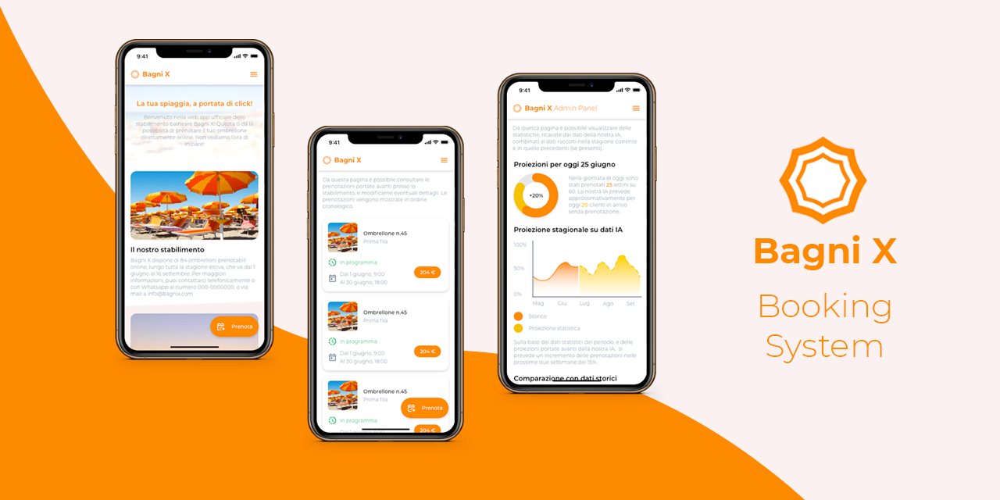

# Bagni X Booking System

Progetto d'esame per il corso di [Applicazioni e Servizi Web](https://www.unibo.it/it/didattica/insegnamenti/insegnamento/2020/412604), parte del corso di laurea magistrale in [Ingegneria e Scienze Informatiche](https://corsi.unibo.it/magistrale/IngegneriaScienzeInformatiche), sede di Cesena.

## Membri del team
 - [Riccardo Maldini](https://github.com/maldins46) - [riccardo.maldini2@studio.unibo.it](riccardo.maldini2@studio.unibo.it)
 - [Francesco Gorini](https://github.com/francescogorini) - [francesco.gorini@studio.unibo.it](francesco.gorini@studio.unibo.it)
 - [Thomas Angelini](https://github.com/ThomasAngeliniUnibo) - [thomas.angelini@studio.unibo.it](thomas.angelini@studio.unibo.it)
    
## Docente 
[Silvia Mirri](https://www.unibo.it/sitoweb/silvia.mirri)
 
## Progetto
Il progetto si propone di realizzare una web app, ideata per un generico stabilimento balneare “Bagni X”. In particolare, lo scopo è la **gestione delle prenotazioni**: gli utenti possono registrarsi, quindi prenotare determinati postazioni - ombrelloni, in un dato periodo di tempo.

## Funzionalità
Verranno forniti in particolare due punti di accesso, uno per l’utente **admin** (responsabile dello stabilimento), e uno per l’utente customer.

L’admin può **personalizzare** le caratteristiche dello stabilimento, i prezzi per periodo (es. alta - bassa stagione, sconti infrasettimanali ecc.) e i servizi aggiuntivi forniti. Esso potrà inoltre gestire le prenotazioni dei clienti, visualizzando le statistiche sulle **prenotazioni**, confermandole o rifiutandole. 

Le informazioni mostrate all'admin, in particolare, presenteranno caratteristiche:

 - di tipo **predittivo**, andando a stimare l’andamento futuro della stagione, in base ai dati pregressi, ai vari periodi della stagione, e ad altre informazioni di rilievo;

 - di tipo **statistico**, andando ad aggregare i dati raccolti nella stagione corrente, tramite grafici e differenti visualizzazioni.

L’utente può visualizzare le caratteristiche dello stabilimento ed effettuare **richieste di prenotazione**, per determinati periodi di tempo (mezza giornata, un giorno, più giorni), in uno o più ombrelloni. Esso potrà inoltre specificare la volontà di usufruire di servizi aggiuntivi (come il lettino addizionale, o l’accesso al campo da beach volley). L’admin dovrà quindi confermare la prenotazione, tramite la propria interfaccia.

Lo scopo primario del progetto è quello di realizzare un **sistema di prenotazioni, ma non di pagamento**. Ciò esula dagli scopi del progetto, e presenta inoltre delle problematiche di difficile gestione.

## Funzionalità aggiuntive
Se i tempi di progetto lo consentiranno, e non risulterà eccessivamente complesso porlo in atto, si prevede di affinare l’applicazione tramite delle funzionalità extra, secondo un approccio di tipo incrementale. 

Si pensava di utilizzare ad esempio dei dati meteo forecast, per affinare le predizioni, e mostrare informazioni aggiuntive agli utenti customer. O ancora, di affinare ancora più gli algoritmi predittivi, sfruttando reti neurali, e framework di ML quali TensorFlow.

**Update**: rispetto al piano iniziale di progetto, ulteriori funzioni sono in corso di valutazione; in particolare:
 - Differenti tecnologie per la gestione dell'authentication, rispetto alla bozza iniziale. Utilizzare Firebase Authentication introduce caratteristiche interessanti, ma anche una complessità aggiuntiva, e la mancanza di una gestione centralizzata dell'autenticazione. Un si sta valutando quindi di utilizzare sistema interno al server node;
 - Ulteriori possibilità di implementazione del layout degli ombrelloni per l'admin;
 - Personalizzazione della welcome screen mostrata agli utenti, da parte dell'admin.

## Tecnologie
Si prevede di sviluppare il progetto tramite stack MEAN puro, ovvero utilizzando Angular per il front-end, Express e NodeJS per gli aspetti di back-end, e MongoDB per gli aspetti legati alla memorizzazione persistente dei dati. L’autenticazione verrà implementata tramite l’utilizzo di Firebase Authentication, un servizio di Google che agisce da server di autenticazione separato, permettendo l’utilizzo di provider OAuth2 come quelli di Google e Facebook (**update**: in corso di valutazione soluzioni differenti). 

Verranno utilizzate varie metodologie di testing, sia per quanto riguarda aspetti HCI/UX/UI (tramite focus group, test con utenti, prototipazione dell'interfaccia tramite il sw Adobe XD), sia per quanto riguarda la mera correttezza del codice, sfruttando dei framework di testing (ancora da definire) e tecniche di CI.

Si pensa inoltre di organizzare il lavoro tramite metodologie Scrum e GitHub Flow. I vari servizi (client, server, db) saranno implementati tramite container Docker, saranno fornite a fine progetto una o più repository GitHub, con l’elaborato testabile.

## Deployment
Un makefile è fornito all'interno del progetto, per rendere immediato il dispiegamento dei container su tecnologia Docker. Tra i comandi più importanti:
- **`make`** (o **`make deploy`**): dispiega tutti container utilizzati per database e web server (per l'attivazione in produzione);
- **`make server-dev`**: genera dipendenze e build per il web server e avvia un'istanza locale del web server direttamente su Node, senza passare per la containerizzazione Docker (utile in fase di sviluppo server). Richiede un'istanza MongoDB in esecuzione in `localhost:27017`;
- **`make client-dev`**: genera dipendenze e build per il client Angular e avvia un'istanza locale del server Angular di sviluppo, senza passare per la containerizzazione Docker (utile in fase di sviluppo client). Non richiede istanze server e database, basando le risposte su un backend mock;
- **`make integration`**: genera dipendenze e build per il client Angular e per il web server, avviando un'istanza locale del web server comprensivo di client Angular (utile in fase di integrazione client-server). Richiede un'istanza MongoDB in esecuzione in `localhost:27017`;

